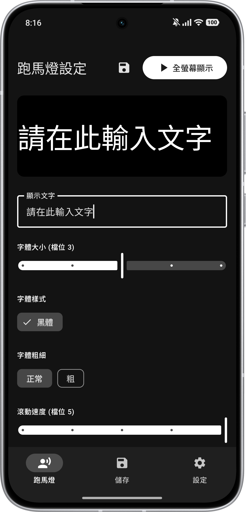
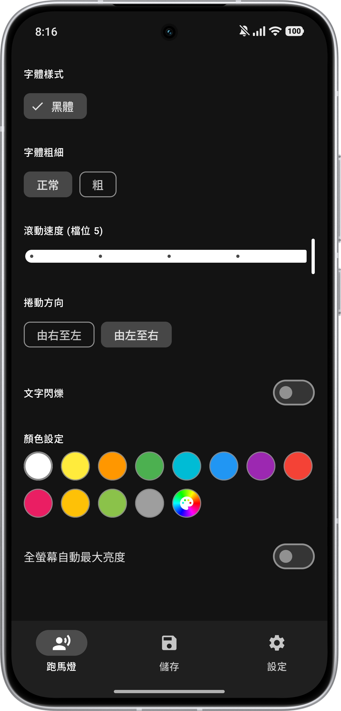
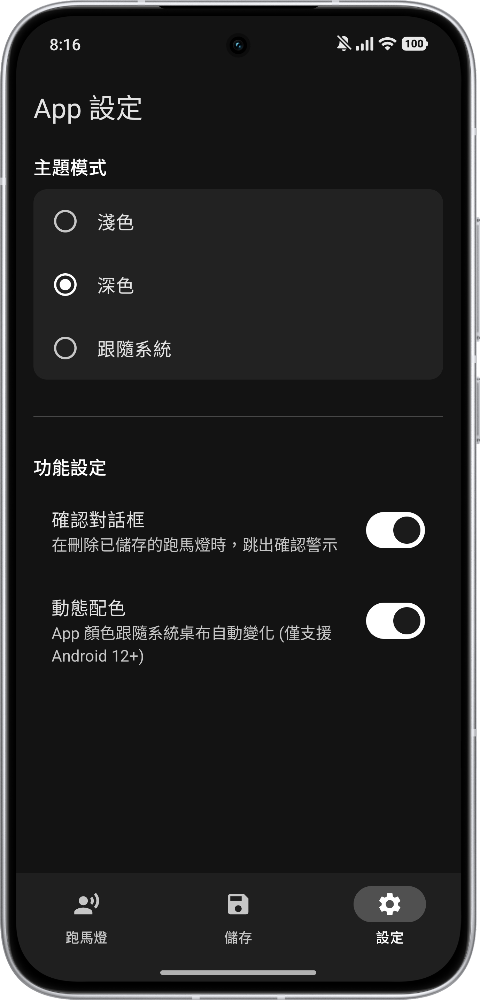

\# Marquee App - Open Source Android Marquee

A modern marquee application developed for the Android platform using \*\*Kotlin\*\* and \*\*Jetpack Compose\*\*. This project offers highly customizable dynamic text effects with an intuitive UI interface.

\## 📱 Key Features

This application provides comprehensive customization options for your marquee, allowing users to create dynamic text tailored for various scenarios (e.g., concert cheering, event announcements):

\* \*\*📐 Font Customization\*\*: Real-time adjustments for font size, weight, and scrolling direction, ensuring optimal readability on all screen sizes.

\* \*\*⚡ Speed Control\*\*: Easily toggle between smooth, slow, or high-speed scrolling.

\* \*\*🎨 Color Customization\*\*: Full palette support with preset options, including dynamic font color changes and text blinking effects.

\* \*\*🔄 Live Preview\*\*: Instant visual feedback; any modifications (text, color, speed) are reflected in real-time.

\* \*\*🕹️ Preset Management\*\*: Save your favorite marquee parameter combinations (including text content and scrolling speed) to build your own personal preset list.

\## 🛠️ Tech Stack \& Architecture

\* \*\*Language\*\*: Kotlin

\* \*\*UI Framework\*\*: Jetpack Compose

## 📸 Screenshots & Feature Showcase

### Main Dashboard
 | 

### Management
 | 

\## 🚀 Development Approach: AI-Assisted

Developed using an \*\*AI-Assisted Development\*\* workflow. As the developer, I managed the core feature design, UI interaction logic, and system architecture, while leveraging AI tools for code construction, refactoring, and bug fixing.

\* \*\*Prompt Engineering\*\*: Decomposed Compose state management into specific logic requirements, using high-precision prompts to guide AI in generating UI code.

\* \*\*Rapid Prototyping\*\*: Utilized AI for rapid technical validation, allowing me to focus on user experience and feature completeness.

\* \*\*Debugging \& Refactoring\*\*: Actively reviewed AI-generated code to ensure it aligns with the project's architecture and standards.

\[\*\*回到繁體中文版本 (Traditional Chinese Version)\*\*](README.md)

